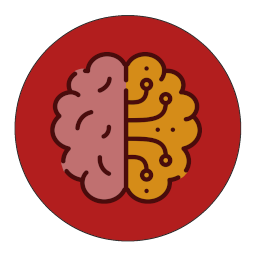

# ML-BCI 
This repo contains the implementation for my bachelor thesis "Deep Learning based Motor Imagery Brain Computer Interface" for the [THU Ulm](https://studium.hs-ulm.de/en)

## Machine Learning based Brain-Computer Interface Framework

* EEGNet Implementation in PyTorch
* Training, Testing, Benchmarking on [PhysioNet Dataset](https://physionet.org/content/eegmmidb/1.0.0/)
  , [BCIC IV 2a](http://www.bbci.de/competition/iv/#dataset2a)
  , [LSMR21](https://figshare.com/articles/dataset/Human_EEG_Dataset_for_Brain-Computer_Interface_and_Meditation/13123148)
* Proposed Implementation for use on NVIDIA Jetson Nano

___

! Datasets ARE NOT INCLUDED in this repository !

- PHYS: Dataset is automatically loaded via the MNE Library
- BCIC: Has to be downloaded manually (see bcic_data_loading.py main method)
- LSMR21: Has to be downloaded via the scripts/lsmr21_download_convert.py script

Change the Location of the Datasets in `paths.py`'s `datasets_folder` variable

### main.py

Main Script to run Training/Benchmarking of EEGNet

`main.py -train`

* n-Class-Classification Training
* K-Fold Crossvalidation
* Saving results and trained model in _./results/{DateTime/Name}/training_
* Dataset Selection with `--dataset` argument

`main.py -benchmark`

* Inference Benchmarking in batches with specified trained model (default size: 16)
* TensorRT optimization possible with `--trt` flag
* Saving results (Batch Latency, Inference time per trial) in _./results/{model_path}/benchmark_

`main.py -train_ss`

* Transfer Learning for further subject-specific Training of pretrained model
* Select pretrained model with `--model` argument
* Subject to train on with `--subject` argument
* Saving subject-specific trained model in _./results/{model_path}/training_ss/S{subject}_

`main.py -live_sim`

* Simulation of a live EEG run classification of a single subject with subject-specific trained model
* Select subject-specific trained model with `--model` argument
* Plotting the run in _./results/{model_path}/training_ss/S{subject}/live_sim_

`main.py --help` for all arguments

___

### config.py

Global Default Configuration/Settings

* Training/Benchmarking Settings
* Bandpassfilters
* EEG Channel Configurations for sensorimotor Events

___

### /machine_learning/models/eegnet.py

PyTorch Implementation of EEGNet

Original Source:
[xiaywang/q-eegnet_torch](https://github.com/xiaywang/q-eegnet_torch/blob/0f467e7f0d9e56d606d8f957773067bc89c2b42c/eegnet.py)

### /machine_learning/modes.py

Main loops for

* EEGNet Training + Testing on Physionet Dataset using 5-Fold CV
* Subject-specific Training with Transfer Learning
* Benchmarking of Inferencing over Physionet Dataset with pretrained model
* Live Simulation of real time Classification on Physionet Dataset Run

### /machine_learning/inference_training

Main methods for

* Training
* Testing
* Benchmark
* Predicting on Batches of Data

___

### /data/datasets/{...}_data_loading.py's

* Data Loaders for the used Datasets
* Wrap Datasets in PyTorch Dataloader

### /data/datasets/physionet_dataset.py

* All important Properties of the Physionet Motorimagery Dataset
* List of available Subjects, Tasks, Runs
* Default Values for Epoching (tmin, tmax, ...)

### /data/datasets/bcic_dataset.py

* All important Properties of the BCIC Motorimagery Dataset
* List of available Subjects, Tasks, Runs
* Default Values for Epoching (tmin, tmax, ...)

### /data/datasets/lsmr21_dataset.py

* All important Properties of the LSMR21 Motorimagery Dataset
* List of available Subjects, Tasks, Runs
* Default Values for Epoching (tmin, tmax, ...)

### /data/data_utils.py

* TrialsDataset class for usage with PyTorch Dataloader
* Utility methods ofr preprocessing data

___

## Scripts

Have to be executed as python modules with:

```python3 -m scripts.<script_name> ```

### example_all_modes.py

* Showcases usage of all available modes in a single script
* Gives overview on how to use main.py with its arguments in a Terminal

### batch_training.py

* Can be used for Batchruns of Training Runs
* Training Configurations editable in Python Dictionary
* Creates .csv and .txt files containing Results of Training Batchruns

### neural_responses_training.py

* Can be used to analyze influence of different Frequency bands
* Test neural responses in different time slices

### best_fold_frequency_test.py

* Can be used to Test trained model of neural_responses_training.py
* Tests different Fx-filtered Test Data of trained Model

#### bench_all_confs.py

* Runs _main.py_ with all possible Configurations in benchmark mode (/w TRT (fp16/32))
* Saves results in parent folder _./results/{model_path}/benchmark/_
* Benchmarking with different Batch Sizes with `--batch_size` argument

#### visualize_bench_all.py

* Plots and saves Results from _bench_all_confs.py_ Runs as .png
* `--model` specifies the folder location of the _results.npz_ file

#### /paths.py

* All relevant paths, results folder locations, file names, ...

#### /util/plot.py

* Plot Results with Matplotlib

#### /util/configs_results.py

* Handles storing results/config .txt files

#### python_test.py

Python Playground for testing, has no further use

---

## Cuda/PyTorch setup
* CUDA v10.1 used
* install correct pytorch version with:
  ```
  
  ```

## Libraries

Use `python3 -m pip install -r requirements.txt` to ensure all necessary libraries are installed

For usage of `-benchmark` also ensure TensorRT is correctly setup on the system

[Numpy](https://numpy.org/)

[PyTorch](https://pytorch.org/)

[PyCuda](https://documen.tician.de/pycuda/)

[MNE](https://mne.tools/stable/index.html)

[torch2trt](https://github.com/NVIDIA-AI-IOT/torch2trt)

[Matplotlib](https://matplotlib.org/)

[Pandas](https://pandas.pydata.org/)


## Attributions

<a href="https://www.flaticon.com/free-icons/brain" title="brain icons">Brain icons created by Freepik - Flaticon</a>